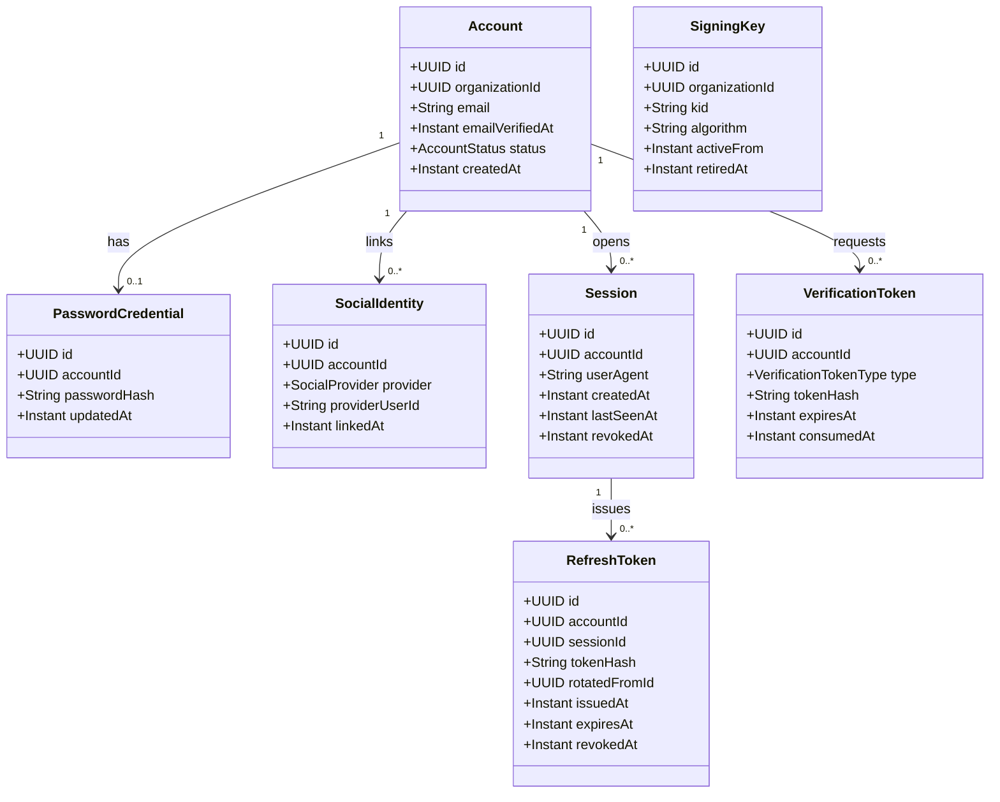
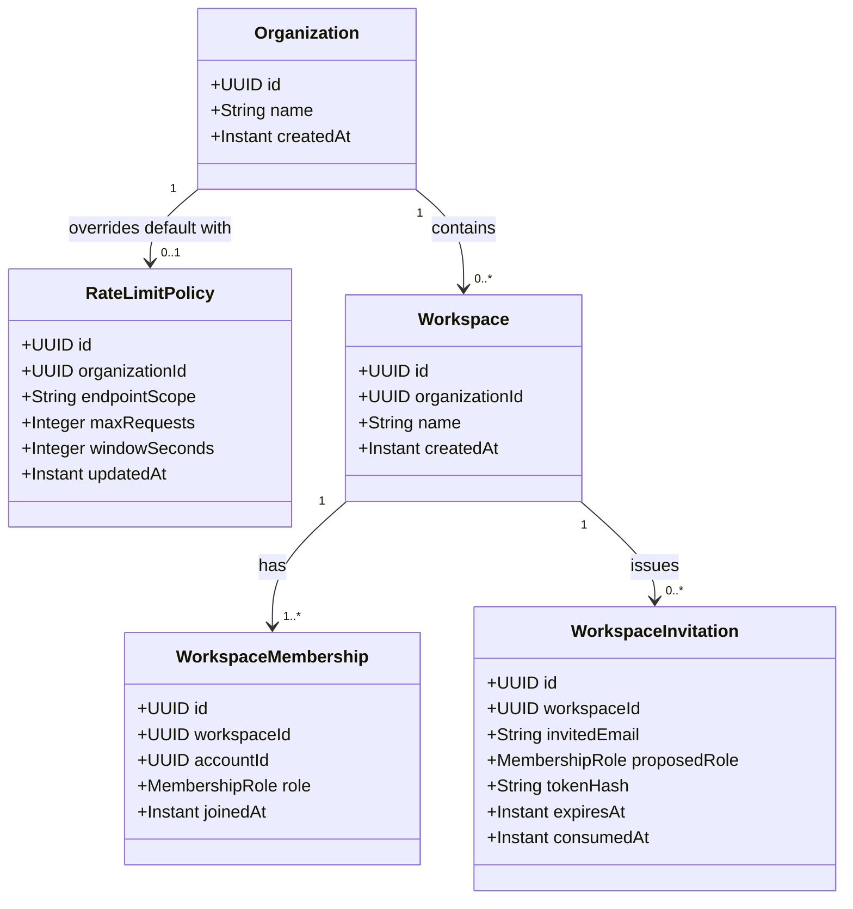
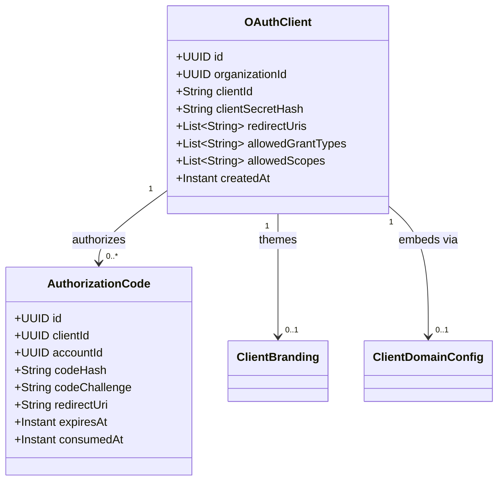
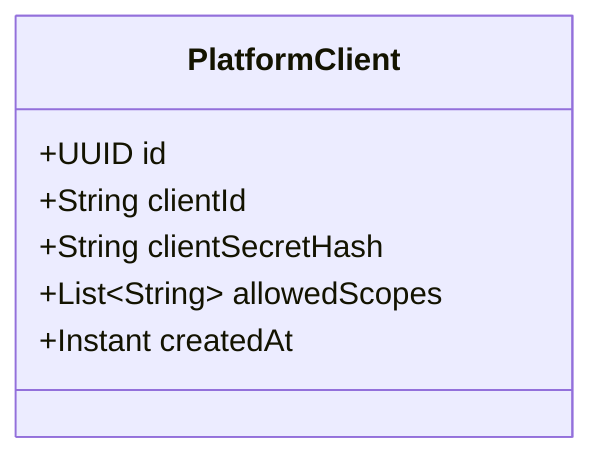
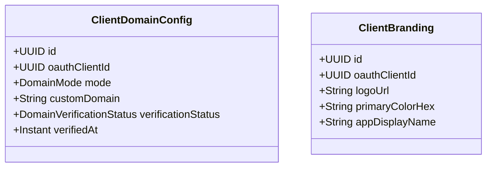
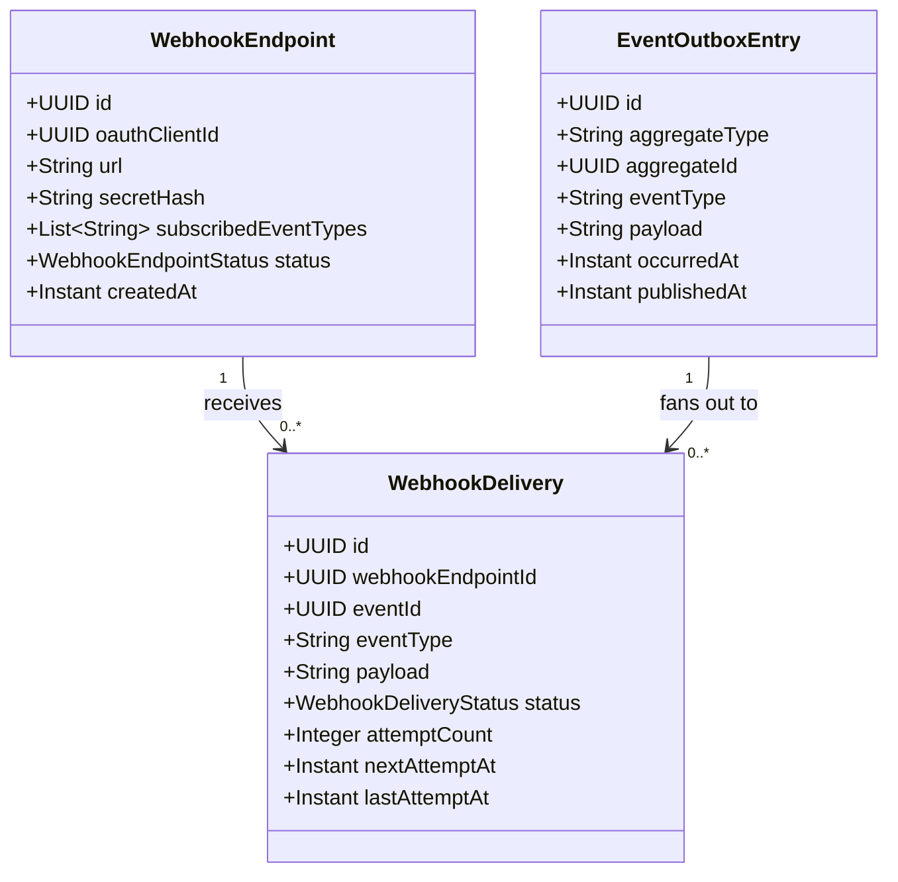

# Domain Model — Clavaris

🟡 En revisión

## 1. Bounded contexts

Three bounded contexts, matching the project's own modules. Each owns its own ubiquitous language — a `Role` in `organization-module` (a membership role) is a different concept from a `Scope` in `client-registry-module` (an OAuth permission grant), and neither leaks into the other's model.

## 2. `identity-module` — core entities

- **`Account`** — BR-ID-02: never has zero authentication methods (at least one of `PasswordCredential` or a `SocialIdentity` must exist at all times).
- **`Account.organizationId`** — ADR-0010: mandatory, references `organization-module`'s `Organization` (tenant isolation boundary) by UUID only. Uniqueness moves from a global `email` constraint to `(organizationId, email)` — the same email address can be an entirely separate, unrelated `Account` in a different `Organization`. There is no cross-organization identity linking in this design.
- **`RefreshToken.rotatedFromId`** exists specifically to support BR-ID-03's reuse-detection: presenting a token whose `rotatedFromId` chain shows it was already superseded triggers revocation of the entire session's token family, not just that one token.
- **`VerificationToken`** is a single model serving both email verification and password reset (`type` discriminates) — BR-ID-04/BR-ID-05: single-use, time-limited, delivered only to the email of record.
- **`SigningKey`** models RS256 key rotation with overlap — `retiredAt` is set when a key stops signing new tokens, but the key stays published in JWKS until every token signed under it has naturally expired.
- **`SigningKey.organizationId`** — ADR-0010 §5: mandatory; JWKS is per-`Organization`, not Clavaris-wide. A verifier application only ever needs its own Organization's JWKS document; rotation of one Organization's key has no effect on any other Organization's keys or rotation schedule. A signing-key compromise is a single-tenant incident, not a Clavaris-wide one.
- **Issuer** — ADR-0010 §5.1: each `Organization`'s issuer is `{clavarisBaseUrl}/o/{organizationId}`, path-based (not subdomain), resolved natively by Spring Authorization Server's per-request issuer support (ADR-0003). Every token's `iss` claim, and every `OAuthClient`'s discovery URL, is scoped under its own Organization's path.
- **Key rotation (v1 scope)** — ADR-0010 §5.2: a manually-triggered, audited management-API operation per Organization (not a scheduler-driven job in v1) generates a new key and retires the previous one with overlap, same guarantee as `SigningKey`'s own invariant above, sized for a solo-developer-operated handful of tenants. Unattended scheduled rotation is v1.1.
- **`PlatformSigningKey`** — ADR-0010 (Organization provisioning): a single, structurally separate key set signing tokens for the platform issuer only (`client-registry-module` §4a's `PlatformClient`), never for any tenant's `Account`. Kept as its own small table rather than a nullable `organizationId` on `SigningKey`, for the same reason `PlatformClient` is its own table — a forgotten null-check is a worse risk than one extra table. Same overlap-rotation guarantee as `SigningKey`.

## 3. `organization-module` — core entities

**Two distinct concepts live here since ADR-0010 — do not conflate them:** `Organization` is the tenant **isolation boundary** (one row per consuming system, e.g. "JobSeeker"); `Workspace` is a team/company grouping **within** one Organization's isolated account pool (the old pre-ADR-0010 "Organization" concept, renamed to free up the name). A `Workspace` cannot span organizations — its members are drawn exclusively from its own `Organization`'s `Account` pool.

- **`Organization`** — ADR-0010: the tenant isolation boundary. One row per consuming system; owns a fully independent pool of `identity-module` `Account`s (§2) and of `client-registry-module` `OAuthClient`s (§4), its own `SigningKey`/JWKS (§2), and its own rate-limit budget. Organizations are mutually exclusive by construction — there is no query path from one Organization's data into another's.
- **`RateLimitPolicy`** — ADR-0010 §6.2: **capacity layer only** (noisy-neighbor protection), an optional one-to-one override of the system-default per-`Organization` aggregate request ceiling. Absence of a row means "use the system default," never "unlimited," and no policy can ever exceed a hard system-wide cap. **v1: operator-managed only** — no self-service tenant editing yet, matching manual `OAuthClient` registration (`prd-mvp.md` §2.2); self-service arrives in v1.1 gated on audit logging of changes. Enforcement bucket keys in Redis are namespaced by `organization_id`.
- **Anti-abuse layer (ADR-0010 §6.1, not a stored entity)** — fixed, system-defined thresholds keyed by `(organization_id, account_or_ip_identifier)`, applied uniformly to every Organization and never tenant-configurable, even in v1.1. This is the actual credential-stuffing defense BR-ID-06 exists for; `RateLimitPolicy` above governs capacity, not this.
- **`Workspace.organizationId`** — mandatory; a Workspace always belongs to exactly one Organization. Renamed from the pre-ADR-0010 `Organization` entity — same semantics (a company/team grouping inside one consumer's usage), different name to avoid colliding with the new tenant-boundary meaning of "Organization."
- **`WorkspaceMembership.role`** — `OWNER | ADMIN | MEMBER`, fixed enum in v1 (BR-WS-01: exactly one `OWNER` at all times, enforced at the application layer, not left to a database constraint alone since ownership transfer is a two-row atomic operation).
- **`WorkspaceInvitation`** — BR-WS-02: scoped to one email + one workspace, expires, single-use (`consumedAt`).

## 4. `client-registry-module` — core entities

- **`OAuthClient.organizationId`** — ADR-0010: mandatory; every `OAuthClient` belongs to exactly one `Organization` (tenant isolation boundary, §3). One Organization may register several `OAuthClient`s (e.g. a web app and a mobile app for the same consuming system) that share that Organization's isolated `Account` pool. This is the actual isolation mechanism: the hosted login page for a given `client_id` only ever authenticates against its own Organization's accounts.
- **`OAuthClient.redirectUris`** — BR-CLIENT-01: exact-match allowlist, no wildcards.
- **`AuthorizationCode.codeChallenge`** — BR-CLIENT-03: PKCE is mandatory for every client, so every authorization code carries a challenge, with no code path that skips this for "trusted" confidential clients.

### 4a. Platform tier — ADR-0010 (Organization provisioning)

- **`PlatformClient`** — structurally separate from `OAuthClient`, deliberately **not** a nullable-`organizationId` row on the same table. Authenticates the entire `/api/v1/admin/*` management-API surface in v1, including `POST /api/v1/admin/organizations` itself — the one call that, by definition, can't be authenticated by a token belonging to the `Organization` it's about to create. Issued against a **platform issuer** (`{clavarisBaseUrl}/oauth2/...`, no `/o/{organizationId}` prefix), signed by `PlatformSigningKey` (§2) — never reachable through, or confusable with, any tenant's own OIDC surface. Scopes are namespaced `platform:*`, reserved and distinct from any per-Organization management scope. The first `PlatformClient` row is seeded from environment variables (`PLATFORM_BOOTSTRAP_CLIENT_ID`/`PLATFORM_BOOTSTRAP_CLIENT_SECRET`) at startup, idempotently — never a "break glass" endpoint, never a credential shipped in code.

### 4b. Embedded/branded login — 🟡 proposed, see ADR-0009

- **`ClientDomainConfig`** and **`ClientBranding`** are separate tables from `OAuthClient`, same "no nullable column bolted onto the core entity" convention as `PasswordCredential`/`SocialIdentity` on `Account` (`data-model.md` §2) — most clients never configure either, and BR-CLIENT-04 gates production use of the embedded experience on `verificationStatus = VERIFIED`.
- **`DomainMode`** — `CNAME | PROXY | SHARED` (ADR-0009 §2); `SHARED` (Clavaris's own domain, the only mode that exists today) is the default and the only mode valid outside production.

## 5. `webhook-module` — core entities — 🟡 proposed, see ADR-0007

- **`WebhookEndpoint.oauthClientId`** — references `client-registry-module`'s `OAuthClient` by UUID only, through `webhook-module`'s own port, same cross-module discipline as §5 below (never a live object reference across the boundary).
- **`WebhookEndpoint.secretHash`** — only the hash is persisted; the raw secret is shown once at creation, same principle as `oauth_clients.client_secret_hash` (`data-model.md` §2).
- **`EventOutboxEntry`** — written in the *same transaction* as the domain state change it records (ADR-0007 §1, BR-WEBHOOK-05); `identity-module`/`organization-module` write these rows, `webhook-module`'s dispatcher only ever reads them — this is how the two producing modules stay unaware that `webhook-module` exists at all, preserving the hexagonal dependency rule.
- **`WebhookDelivery.status`** — `PENDING | SUCCEEDED | FAILED | EXHAUSTED` (BR-WEBHOOK-03); `EXHAUSTED` is a terminal state requiring manual replay, never a silent drop.

## 6. Cross-context relationships

`WorkspaceMembership.accountId` and `AuthorizationCode.accountId` both reference `identity-module`'s `Account` — but per the hexagonal dependency rule, no module holds a live object reference across the boundary. Cross-module reads go through each module's own port, keyed by the shared `accountId` UUID, exactly as JobSeeker's own modules avoid leaking internal types across bounded contexts. `WebhookEndpoint.oauthClientId` follows the same rule (§5).

Since ADR-0010, two more cross-module references follow this same discipline and form the actual tenant-isolation mechanism: `Account.organizationId` (`identity-module` → `organization-module`) and `OAuthClient.organizationId` (`client-registry-module` → `organization-module`). Both are ID-only references through each module's own port — `organization-module` never reaches into either module, it is only referenced by them.

## 7. Domain events

**Resolved ambiguity (2026-08-17):** this table used to describe some events as "triggering" a reaction without saying whether that reaction was synchronous or async — genuinely ambiguous for the rows touching a security/data invariant. It isn't one kind of reaction; it's two, and this project treats them very differently:

- **Invariant-enforcing cascades** — a reaction that a business rule requires to be immediate and guaranteed (revoking sessions, revoking a whole refresh-token family, removing workspace memberships on account deletion). These are performed **synchronously, inside the same use case's transaction**, via a direct call to the other module's own port — `domain-model.md` §6's "no live object reference, ID-only port call" rule already permits this, since a port call is not required to be asynchronous; it only forbids passing live domain objects across the boundary. The named event is raised **after** the cascade has already completed successfully, purely as a factual record of what just happened — it is never the mechanism that *causes* the cascade, and nothing downstream (an event listener, `webhook-module`'s dispatcher) is ever load-bearing for these invariants holding. This is required because BR-ID-03, BR-ID-04, and BR-DATA-03 need guaranteed immediate completion — an internal event that's lost, delayed, or processed out of order here isn't a UX bug, it's a security gap (e.g. a workspace membership that outlives the account deletion that was supposed to remove it).
- **Best-effort side effects** — a reaction with no correctness requirement (sending a verification/reset email, delivering a webhook to an external consumer, raising an observability alert). These are legitimately asynchronous, don't gate the use case's success response, and a delay or transient failure here is an operational concern (retried per ADR-0007 for webhooks), not a correctness one.

| Event | Raised by | Nature of the reaction | Also written to `event_outbox`? |
|---|---|---|---|
| `AccountRegisteredEvent` | `identity-module` | Best-effort: triggers email verification send (async, retryable — a delayed verification email is not a correctness issue) | ✅ → `account.created` |
| `AccountEmailVerifiedEvent` | `identity-module` | — | ✅ → `account.email_verified` |
| `PasswordResetRequestedEvent` | `identity-module` | Best-effort: triggers reset email send | ❌ (internal only — a reset request is not a fact a consumer needs) |
| `PasswordResetCompletedEvent` | `identity-module` | **Invariant cascade, already completed before this event is raised**: all active sessions/refresh tokens are revoked synchronously, same transaction (BR-ID-04) | ❌ (internal only) |
| `RefreshTokenReuseDetectedEvent` | `identity-module` | **Invariant cascade, already completed before this event is raised**: full-account token revocation, synchronous (BR-ID-03). The security alert (NFR §5) is a separate best-effort side effect, not a gate on the revocation itself | ✅ → `refresh_token.reuse_detected`, so a consumer can react (e.g. force logout its own session) |
| `AccountDeletedEvent` | `identity-module` | **Invariant cascade, already completed before this event is raised**: `organization-module`'s workspace memberships are removed synchronously via a direct port call in the same transaction (BR-DATA-03) — never via an event listener reacting to this event later | ✅ → `account.deleted` |
| `WorkspaceInvitationAcceptedEvent` | `organization-module` | **Invariant, already completed before this event is raised**: the corresponding `WorkspaceMembership` is created synchronously by the same use case that accepts the invitation, not by a listener reacting to this event | ✅ → `membership.created` |

Not every internal domain event becomes a webhook — only the ones a consumer plausibly needs to react to (ADR-0007 §3). This table is the seed of the event catalog in `prd-mvp.md` §2.3; extending it is additive (BR-WEBHOOK area) and does not require an ADR revision by itself. **When adding a new row, classify it as one of the two reaction kinds above explicitly — don't leave a new ambiguous "triggers X" without saying which.**

## 8. Open questions

- Social-login account linking (see `prd-mvp.md` §5) needs a domain-level answer: does linking-by-verified-email happen automatically, or does it raise a `SocialIdentityLinkPendingEvent` requiring explicit confirmation via the existing email address? Leaning toward the latter for safety; not yet decided. Note this linking is now implicitly scoped to one `Organization` (ADR-0010) — the same Google account linking to two different `Organization`s' `Account`s is two independent links, not one.
- Should `Session` and `RefreshToken` be merged into one aggregate, or kept separate as modeled here (one session can have a chain of rotated refresh tokens)? Kept separate for now because reuse-detection needs to reason about the *chain*, not just the current token — revisit once the actual use case implementation surfaces friction.
- ~~Multi-consumer identity scenario flagged in `business-rules.md` (BR-DATA-03 open question)~~ — resolved by ADR-0010: `Account` is now `Organization`-scoped, so "the same Clavaris account used to log into two consumers" is structurally impossible, not an open design question.
- ADR-0010's own open questions (Organization provisioning ownership, system-wide rate-limit ceiling value, automated key-rotation tooling) are tracked there, not duplicated here.
- `webhook-module` (§5) is new and carries its own open questions — see ADR-0007's own open-questions section (secret rotation, delivery log retention, outbox cleanup) rather than duplicating them here.
