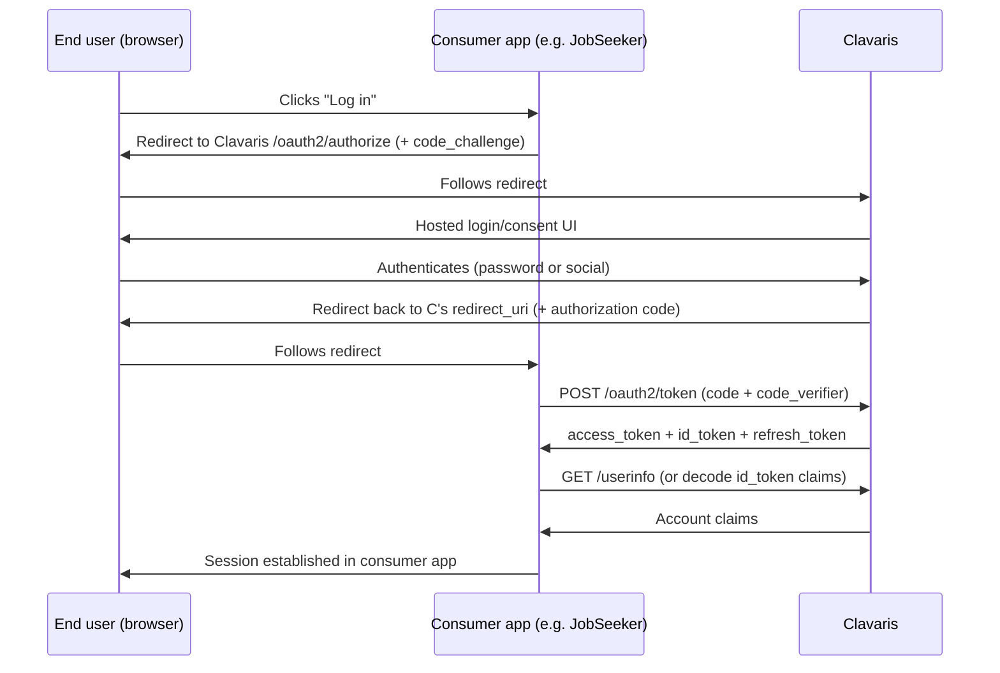

# Integration Design — Clavaris

🟡 En revisión

Describes how a consumer application (JobSeeker first) integrates with Clavaris. This is the document a new consumer's developer should read end-to-end before writing any code.

## 1. Integration flow (Authorization Code + PKCE)

*(Every URL in this flow — `/authorize`, `/token`, the hosted login UI's own origin — is scoped under the consumer's `Organization`, `{clavarisBaseUrl}/o/{organizationId}/...`, ADR-0010 §5.1. Omitted from the diagram above for readability; see §2 for the exact shape.)*

## 2. What a new consumer needs to do

1. Have (or be assigned) an `Organization` — the tenant isolation boundary a new consuming system is provisioned under (operator-only in v1, ADR-0010). JobSeeker is one `Organization`; a second consumer gets its own, with its own isolated account pool, never sharing accounts with JobSeeker's.
2. Register as an `OAuthClient` under that `Organization` (manual/admin process in v1 — `prd-mvp.md` §2.2): provide exact `redirect_uris`, request needed scopes. A consumer needing multiple apps (web + mobile) can register several `OAuthClient`s under the same `Organization`, sharing its account pool.
3. Point any standard OIDC client library at this Organization's own discovery URL — `{clavarisBaseUrl}/o/{organizationId}/.well-known/openid-configuration` (ADR-0010 §5.1), **not** a Clavaris-wide root — and implement the flow above. No Clavaris SDK exists or is planned (ADR-0006); the only consumer-specific configuration is this one URL. **The token exchange (`POST /oauth2/token`) must happen server-side, in the consumer's own backend — never from browser JavaScript** (ADR-0013): every `OAuthClient` requires `client_secret_basic` in addition to PKCE, so there is no client type that can complete this step from a browser, and no CORS policy exists on this or any other OIDC endpoint. A consumer without its own backend (a purely static SPA) cannot integrate with Clavaris as designed today — see ADR-0013's own "Alternatives considered" for what that would require.
4. Validate access tokens either by calling `/userinfo` per-request, or (recommended for performance) by verifying the JWT signature locally against this Organization's own published JWKS (discovered from the same discovery document) and caching the key set per standard HTTP cache headers. A JWKS document only ever contains this Organization's keys — never another tenant's.
5. Implement token refresh using the rotating refresh token, and handle the (rare, security-relevant) case of an `invalid_grant` error on refresh — this signals the refresh token was already rotated (reuse detected), meaning the consumer must force the user to re-authenticate, not silently retry.

## 3. JobSeeker's specific integration shape

Per JobSeeker's own `security-architecture.md` §2: JobSeeker's `auth-module` acts purely as an OIDC relying party. JobSeeker's local `accounts` table is an explicit **mirror, not a source of identity** — `id` is Clavaris's `sub` claim, and JobSeeker never stores `email`/`password_hash`/refresh tokens locally (see JobSeeker's `docs/02-domain/data-model.md` §4.1). This is the reference integration pattern any future consumer should follow: store only what's needed to join local domain data to an identity, never duplicate the credential itself.

## 4. Account deletion integration

When a consumer's own data-deletion process (e.g. JobSeeker's ADR-0013 grace-period-then-anonymize flow) completes, it calls Clavaris's management API (`POST /api/v1/admin/accounts/{id}:delete`, `api-contract-overview.md` §3) to delete the underlying identity. Clavaris does not run its own independent grace period for this — the consumer owns that policy decision entirely (BR-DATA-02).

## 5. Webhook integration (push from Clavaris to the consumer) — ✅ shipped 2026-09-02, see ADR-0007

Unlike every flow above (consumer → Clavaris), this is the one direction where Clavaris pushes to the consumer, so a consumer can react to identity/org events without polling:

1. Register a webhook endpoint (`POST /api/v1/admin/organizations/{organizationId}/webhook-endpoints`) with a URL and the event types to receive (`prd-mvp.md` §2.3's event catalog) — receive the signing secret exactly once, store it securely on the consumer's side.
2. For every incoming `POST`, verify the `Clavaris-Signature` header (HMAC-SHA256, BR-WEBHOOK-01) before trusting the payload — treat an unverified request as untrusted input, same as any other public webhook endpoint.
3. Respond `2xx` quickly (process asynchronously on the consumer's side if the reaction is slow) — a timeout counts as a failed delivery and triggers a retry (BR-WEBHOOK-03).
4. Deduplicate on `event.id` (BR-WEBHOOK-02) — delivery is at-least-once, so the same event can arrive more than once.

This is the reference pattern any future consumer should follow to keep a local read model (e.g. a mirrored `accounts` table, per §3 above) in sync with Clavaris without polling.

## 6. Open questions

- Should Clavaris publish a reference integration example (a minimal working consumer app, even a toy one) rather than relying purely on prose documentation? Would directly support the "under a day" integration-cost goal (`nfr-quality-attributes.md` §4) — not yet built, worth prioritizing early in v1.1.
- ~~Webhook/event notification from Clavaris to consumers is not designed~~ — **resolved and shipped 2026-09-02**: see §5 above and **ADR-0007**, whose own three open items (signing secret rotation, delivery log retention, outbox cleanup) are now all resolved there too.
