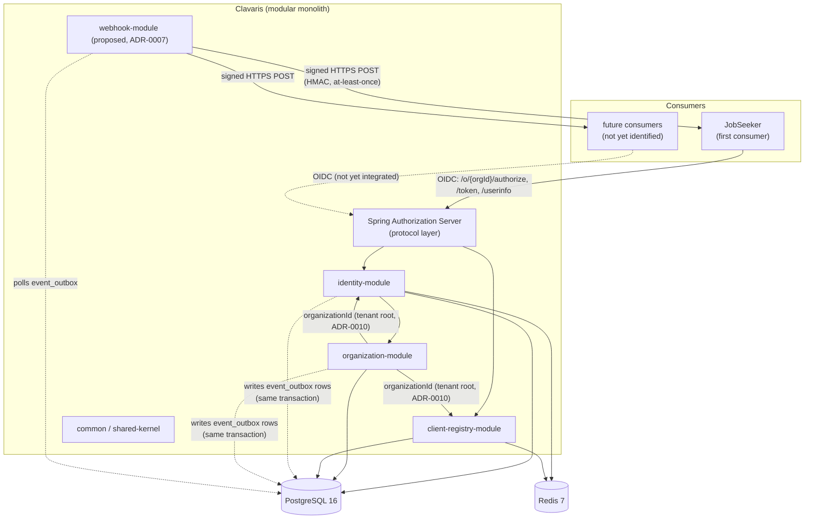

# System Design Document — Clavaris

🟡 En revisión

**Documentos relacionados:** ADRs 0001-0010, `docs/02-domain/domain-model.md`, `docs/02-domain/data-model.md`, `docs/04-security/security-architecture.md`, `docs/03-architecture/spikes/` (technical investigation reports backing specific ADR decisions — currently `0001-spring-authorization-server-multitenancy.md`, backing `ADR-0003`/`ADR-0010`).

## 1. Architecture overview

Clavaris is a modular monolith (single deployable, `CLAUDE.md` §3) exposing a standard OIDC/OAuth2 surface (ADR-0006) built on Spring Authorization Server (ADR-0003). Internally it follows the same DDD + Hexagonal + Vertical Slice model as JobSeeker (`CLAUDE.md` §7), with three business modules plus a shared kernel, plus a proposed fourth module (`webhook-module`, ADR-0007, 🟡 not yet approved) for asynchronous event delivery to consumers.

## 2. Module interaction

- **`client-registry-module`** owns the `/authorize` and `/token` endpoints' client-facing validation (redirect URI matching, PKCE challenge verification) and hands off to Spring Authorization Server's token issuance machinery, which calls into `identity-module` to authenticate the resource owner. Since ADR-0010, both `/authorize` and `/token` are resolved under a per-`Organization` issuer path (`/o/{organizationId}/...`) — the tenant is known before authentication begins, not inferred afterward.
- **`identity-module`** is the source of truth for "who is this account" — every other module references accounts by `accountId` only, never holding a live cross-module object reference (`domain-model.md` §6). Since ADR-0010, `identity-module` itself references `organization-module`'s `Organization` by ID (`Account.organizationId`, `SigningKey.organizationId`) — a new dependency direction not present before that ADR, still ID-only per the hexagonal rule (`CLAUDE.md` §7.2).
- **`organization-module`** is consumed by the management API and by `identity-module`'s account-deletion cascade (BR-DATA-03) — it has no dependency back onto `client-registry-module`. Since ADR-0010, it is also the **tenant root**: `client-registry-module`'s `OAuthClient` and `identity-module`'s `Account`/`SigningKey` all reference an `organization-module` `Organization` by ID — `organization-module` is now upstream of both other business modules, not just a peer consumed by them.
- **`webhook-module`** (🟡 proposed, ADR-0007) depends only on the shared `event_outbox` table written by `identity-module`/`organization-module` and on `client-registry-module`'s `OAuthClient` (by ID, through its own port) — neither producing module has any dependency on, or awareness of, `webhook-module`, preserving the hexagonal dependency rule even for this cross-cutting concern.

## 3. Deployment shape (current state)

Single deployable in v1, consistent with the modular-monolith choice — no per-module independent scaling, no service mesh, no distributed transaction concerns. Resolved to "one deployable, not one per module" (the question `docker-compose.yml` used to flag as open) via a new `app` bootstrap module: a thin Spring Boot entry point (`@SpringBootApplication`, component-scanning `com.clavaris.*`) that depends on every business module but contains no domain code itself — the module graph enforces "one process," not just a deployment convention. `docker-compose.yml` at the repo root now runs a real local stack (Postgres 16, Redis 7, the `app` image built from `app/Dockerfile`), each service with its own healthcheck and `depends_on: condition: service_healthy` ordering — not yet a formal ADR, since it's an implementation of the modular-monolith decision (ADR-0001/CLAUDE.md §3) rather than a new architectural choice.

## 4. Key alternatives considered (summary — full detail in linked ADRs)

| Decision | Chosen | Rejected alternative | ADR |
|---|---|---|---|
| Build vs. adopt | Build, on Spring Authorization Server | Auth0/Clerk/Keycloak/Zitadel/Ory | 0001 |
| Token signing | RS256 | HS256 | 0002 |
| Protocol foundation | Spring Authorization Server | Hand-rolled OAuth2/OIDC | 0003 |
| Storage | PostgreSQL + Redis | Redis-only | 0004 |
| Password hashing | Argon2id | BCrypt | 0005 |
| Primary interface | Standard OIDC/OAuth2 | Bespoke API + per-language SDKs | 0006 |
| Consumer event notification | Webhooks + transactional outbox | Direct DB write / polling / message broker | 0007 🟡 |
| API versioning | URI path (`/api/v{n}/admin/...`) + code-generated OpenAPI | Header/media-type versioning, hand-maintained spec | 0008 🟡 |
| Embedded/branded login | iframe-modal + mandatory per-client custom domain (CNAME/proxy) | Embedded widget calling Clavaris's API directly (Clerk's default pattern) | 0009 🟡 |
| Tenant isolation | `Organization`-scoped accounts, per-tenant issuer/JWKS/rate-limit budget | Global `Account` + pre-ADR-0010-style `Membership`-only gating; a new `Tenant` layer above `Organization` | 0010 🟡 |

## 5. Risks

| Risk | Mitigation / status |
|---|---|
| Spring Authorization Server's multi-issuer support is documented, but per-tenant JWKS (required by ADR-0010 §5) is an extension built on top of that hook, not a first-class config option — unvalidated in code | A short spike is required before implementation proceeds past ADR-0010 §5 (see ADR-0003 addendum) — not yet run |
| Spring Authorization Server abandonment or breaking incompatibility with future Spring Boot versions | Unmitigated — accepted assumption, flagged in `project-charter.md` §6; re-confirmed, not re-mitigated, by ADR-0003's addendum |
| Solo-developer operational burden (≥99.5% availability target, key rotation ceremony) | NFRs deliberately calibrated to be achievable solo (`nfr-quality-attributes.md` §6); since ADR-0010, this scales with organization count (N key pairs, N rotation schedules) — v1 deliberately scopes rotation to a manual-but-real operation for this reason (ADR-0010 §5.2) |
| Cross-project roadmap dependency: JobSeeker's Wave 1 assumes Clavaris v1 exists first, with no shared tracking mechanism between the two repositories | Unresolved — flagged in both `roadmap-and-release-plan.md` (this repo) and JobSeeker's own |
| ~~Multi-consumer identity scenario (one person, one Clavaris account, two consumer apps) has no domain model yet~~ | **Resolved by ADR-0010** — `Account` is scoped to exactly one `Organization`, so this scenario no longer exists by construction |
| No formal audit-logging design for the management API | Known gap (`threat-model-stride.md` §6), now a hard *dependency* for ADR-0010 v1.1 (tenant self-service `RateLimitPolicy` editing is explicitly gated on it) — elevated priority, not yet designed |
